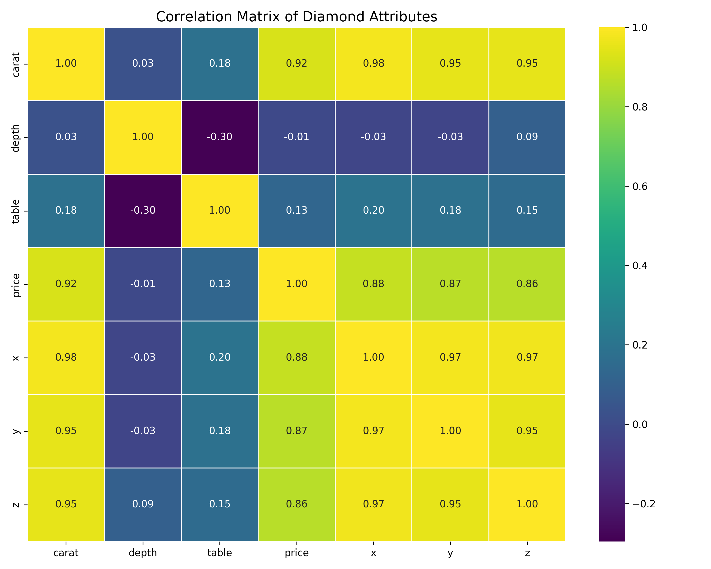
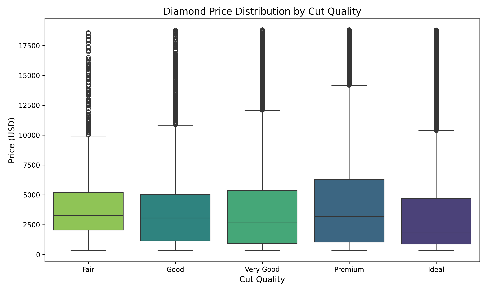

# Module 10: Diamond Price Exploratory Data Analysis

## Research Question
**Can the price of a diamond be determined based upon its features?**

Yes. Through Exploratory Data Analysis (EDA) of 54,000 diamonds, we can determine that a diamond's price is heavily predictable based on its dimensions (specifically carat weight), with secondary attributes like clarity and cut defining the price within those weight boundaries.

---

### 1. Feature Correlation (Seaborn Heatmap)

**Trend Demonstrated:** This heatmap highlights that `carat` weight has the strongest positive correlation with `price` (0.92), alongside the physical dimensions `x`, `y`, and `z` (all >0.86). Proportional metrics like `depth` and `table` have almost negligible direct correlation with the price, indicating that sheer size is the primary monetary driver.

### 2. Price Distribution by Cut Quality (Seaborn Boxplot)

**Trend Demonstrated:** Interestingly, "Ideal" cut diamonds exhibit a lower median price than "Fair" or "Premium" cuts. This counterintuitive trend suggests that cut alone does not drive higher prices; rather, higher-quality cuts might be more frequently applied to smaller carat diamonds, while larger, more expensive diamonds may sacrifice perfect cuts to retain maximum carat weight.

### 3. Carat vs. Price Influenced by Clarity (Interactive Plotly Scatter)

*(Note: A fully interactive version of this plot is included in the directory as `carat_vs_price_scatter.html`)*

**Trend Demonstrated:** This scatter plot visualizes the exponential relationship between carat weight and price. As carat weight increases, the price increases non-linearly. Furthermore, by observing the `clarity` color map, we see distinct bands: at any given carat weight, diamonds with a higher clarity rating sit significantly higher on the price Y-axis.